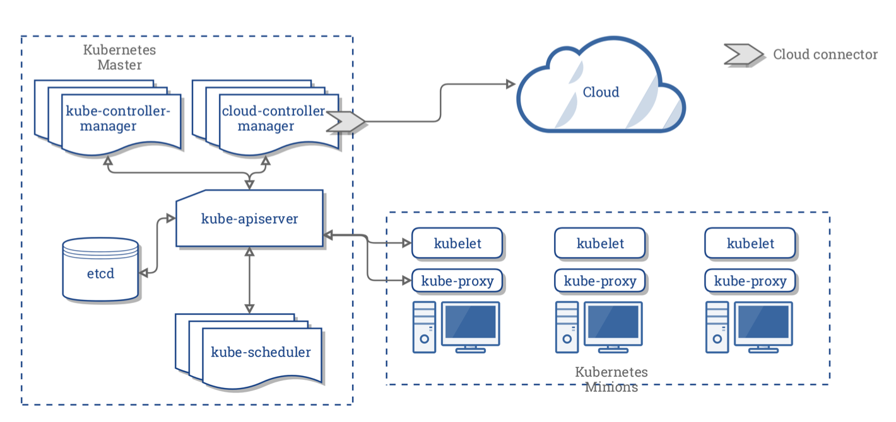

<!--$theme: gaia -->
<!-- *page_number: true -->
<!-- *template: invert -->
<!-- prerender: true -->


Kubernetes Fundamentals
===

# 

###### Created by Diego Pinheiro ( [@s4rd1nh4](https://github.com/s4rd1nh4) )


---

# Agenda
<!--$theme: gaia -->
<!-- *page_number: true -->
<!-- *template: invert -->
<!-- prerender: true -->

- **Containers**
- **Kubernetes Intro**
- **Kubernetes Components**
- **Kubernetes Objects**
- **Kubernetes Controllers**

<a rel="license" href="http://creativecommons.org/licenses/by/4.0/"></a><br />Este obra está licenciado com uma Licença <a rel="license" href="http://creativecommons.org/licenses/by/4.0/">Creative Commons Atribuição 4.0 Internacional</a>.

---

#### Introdução

<!--$theme: gaia -->
<!-- *page_number: true -->
<!-- *template: invert -->
<!-- prerender: true -->

Vou fornecer uma breve explicação dos principais conceitos do Kubernetes.

Vale frisar que o K8S não é uma “bala de prata” - ele não se propõe a resolver todos problemas, muito menos ser a solução única para as mais variadas situações.

---
<!--$theme: gaia -->
<!-- *page_number: true -->
<!-- *template: invert -->
<!-- prerender: true -->
Docker e Containers
---

#### O que são contêineres?

**Em logistica**: Container é uma caixa que foi criada para ser utilizada no  transporte  de mercadorias. O container é construido de forma resistente para ser usado varias vezes.

**Em serviços**: abstração de processos dentro do kernel (`cgroups+namespaces`) :heart:, possivel definir recursos como memoria, rede, S.O, aplicação, serviço e etc.

---

#### Beneficios do Docker
<!--$theme: gaia -->
<!-- *page_number: true -->
<!-- *template: invert -->
<!-- prerender: true -->

**Ambientes semelhantes**
Uma vez que sua aplicação seja transformada em uma imagem Docker, ela pode ser instanciada como container em
qualquer ambiente que desejar. Isso significa que poderá utilizar sua aplicação no notebook do desenvolvedor da mesma forma que seria executada no servidor de produção.

---
<!--$theme: gaia -->
<!-- *page_number: true -->
<!-- *template: invert -->
<!-- prerender: true -->

#### Aplicação como pacote completo
Utilizando as imagens Docker é possível empacotar toda sua aplicação e dependências, facilitando a distribuição, pois não será mais necessário enviar uma extensa documentação explicando como configurar a infraestrutura necessária para permitir a execução, basta disponibilizar a imagem em repositório e liberar o acesso para o usuário e, ele mesmo pode baixar o pacote, que será executado sem problemas.

---
<!--$theme: gaia -->
<!-- *page_number: true -->
<!-- *template: invert -->
<!-- prerender: true -->

#### Padronização e replicação
Como as imagens Docker são construídas através de arquivos de definição, é possível garantir que determinado padrão seja seguido, aumentando a confiança na replicação. Basta que as imagens sigam as melhores práticas de construção para que seja viável escalarmos18 a estrutura rapidamente.

---
<!--$theme: gaia -->
<!-- *page_number: true -->
<!-- *template: invert -->
<!-- prerender: true -->

#### Idioma comum entre Infraestrutura e desenvolvimento

A sintaxe usada para parametrizar as imagens e ambientes Docker pode ser considerada um idioma comum entre áreas que costumeiramente não dialogavam bem. Agora é possível ambos os setores apresentarem propostas e contra propostas com base em um documento comum.

---
<!--$theme: gaia -->
<!-- *page_number: true -->
<!-- *template: invert -->
<!-- prerender: true -->

#### O que é Kubernetes?


Kubernetes é um sistema de orquestração de contêiners open-source que automatiza a implantação,
o dimensionamento e a gestão de aplicações em contêiners. Ele foi originalmente projetado pelo Google e agora é mantido pela Cloud Native Computing Foundation

---
<!--$theme: gaia -->
<!-- *page_number: true -->
<!-- *template: invert -->
<!-- prerender: true -->

#### Um pouco de história
<!--$theme: gaia -->
<!-- *page_number: true -->
<!-- *template: invert -->
<!-- prerender: true -->

O Kubernetes foi criado e desenvolvido pelos engenheiros da Google, uma das pioneiras no desenvolvimento da tecnologia de containers.

# 

---

#### Um pouco de história
<!--$theme: gaia -->
<!-- *page_number: true -->
<!-- *template: invert -->
<!-- prerender: true -->
---
A Google já revelou que executa alguns dos seus serviços em containers, como Google Docs e Gmail, por exemplo, e tem alguns números surreais: são mais de 2 bilhões de implantações de contêineres por semana, que são viabilizadas por uma plataforma interna chamada Borg, antecessor do Kubernetes e que serviu como base para seu desenvolvimento.

---

#### Um pouco de história

<!--$theme: gaia -->
<!-- *page_number: true -->
<!-- *template: invert -->
<!-- prerender: true -->
Em 2015 o Kubernetes foi doado para a “Cloud Native Computing foundation” e Linux Foundations, e se tornou um projeto Open Source.

---

#### Um pouco de história

<!--$theme: gaia -->
<!-- *page_number: true -->
<!-- *template: invert -->
<!-- prerender: true -->
A palavra Kubernetes vem da palavra grega Kuvernetes, que representa a pessoa que pilota o navio.

---

#### Kubernetes Components
<!--$theme: gaia -->
<!-- *page_number: true -->
<!-- *template: invert -->
<!-- prerender: true -->
---

**Master**: O Kubernetes Master é uma coleção de três processos que são executados em um único nó em seu cluster, que é designado como o nó mestre.

Esses processos são:

* **kube-apiserver**, fornece API kubernetes usando json. Estados de objetos da API são armazenados no ETCD, e o kubectl usa o apiserver para se comunicar com o cluster;


---

<!--$theme: gaia -->
<!-- *page_number: true -->
<!-- *template: invert -->
<!-- prerender: true -->
---
* **kube-controller-manager**,   monitora os controladores de replicação e cria os pods para manter o estado desejado;

* **kube-scheduler**, é responsável por executar as tarefas de agendamento, como execução de contêineres nos nodes com base na disponibilidade de recursos.

* **etcd**: é uma base de dados de chave valor. Ele armazena os dados de configuração do cluster e o estado do cluster;

---
<!--$theme: gaia -->
<!-- *page_number: true -->
<!-- *template: invert -->
<!-- prerender: true -->
Kubernetes Components
---
Nodes: Each individual non-master node in your cluster runs two processes:
* kubelet, agente que é executado em cada nó worker, se conecta ao Docker e cuida da criação, execução e exclusão de contêineres;
* kube-proxy, encaminha o tráfego para os contêineres apropriados com base no endereço IP e no número da porta da solicitação recebida.

---
<!--$theme: gaia -->
<!-- *page_number: true -->
<!-- *template: invert -->
<!-- prerender: true -->

Addons:
---
Addons are pods and services that implement cluster features. Namespaced addon objects are created in the kube-system namespace.

* DNS
* Dashboard
* Metricas
* Logs
* Cloud-Controller

---

Kubernetes Components
---

# 

---

#### Kubernetes Objects
<!--$theme: gaia -->
<!-- *page_number: true -->
<!-- *template: invert -->
<!-- prerender: true -->

Kubernetes contains a number of abstractions that represent the state of your system: deployed containerized applications and workloads, their associated network and disk resources, and other information about what your cluster is doing. These abstractions are represented by objects in the Kubernetes API.

--- 

#### Kubernetes Objects
<!--$theme: gaia -->
<!-- *page_number: true -->
<!-- *template: invert -->
<!-- prerender: true -->

The basic Kubernetes objects include:

- Pod
- Service
- Volume
- Namespace

---

#### Kubernetes Objects - Pod
<!--$theme: gaia -->
<!-- *page_number: true -->
<!-- *template: invert -->
<!-- prerender: true -->

**Pod**, que pode ser definido como um grupo de contêineres que são implantados em um único nó de trabalho, é a menor unidade dentro de um cluster Kubernetes. 

```
apiVersion: v1
kind: Pod
spec:
  containers:
  - name: sise
    image: mhausenblas/simpleservice:0.5.0
    ports:
    - containerPort: 9876
  
```

---

#### Basic Kubernetes Objects - Service
<!--$theme: gaia -->
<!-- *page_number: true -->
<!-- *template: invert -->
<!-- prerender: true -->

**Service** exposes one or more pods at a single and stable IP address and port pair

```
apiVersion: v1
kind: Service
metadata:
  name: simpleservice
spec:
  ports:
    - port: 80
      targetPort: 9876
  selector:
    app: sise
```

---

#### Basic Kubernetes Objects - Volume
<!--$theme: gaia -->
<!-- *page_number: true -->
<!-- *template: invert -->
<!-- prerender: true -->


**Volume** is a dir accessible to all containers running in a pod. In contrast to the container-local filesystem, the data in volumes is preserved across container restarts

```
apiVersion: v1
kind: Pod
...
spec:
  containers:
    volumeMounts:
      - name: xchange
        mountPath: "/tmp/data"
  volumes:
  - name: xchange
    emptyDir: {}
```
---

#### Kubernetes Objects - Namespace
<!--$theme: gaia -->
<!-- *page_number: true -->
<!-- *template: invert -->
<!-- prerender: true -->


Com o **Namespace**, você pode dividir seu Cluster de Kubernetes em dois ambientes, como Produção e Teste, por exemplo, podendo limitar os recursos computacionais para ambos.
 
```
apiVersion: v1
kind: Namespace
metadata:
  name: test
```

---

#### Kubernetes Controllers
<!--$theme: gaia -->
<!-- *page_number: true -->
<!-- *template: invert -->
<!-- prerender: true -->


In addition, Kubernetes contains a number of higher-level abstractions called Controllers. Controllers build upon the basic objects, and provide additional functionality and convenience features. They include:

* ReplicaSet
* Deployment
* StatefulSet
* DaemonSet
* Job

---

####  Kubernetes Controllers - ReplicaSet
<!--$theme: gaia -->
<!-- *page_number: true -->
<!-- *template: invert -->
<!-- prerender: true -->

Keeps one or more pod replicas running 

```
apiVersion: extensions/v1beta1
kind: ReplicaSet
spec:
  replicas: 2
  template:
    spec:
      containers:
      - image: mhausenblas/simpleservice:0.5.0
        imagePullPolicy: IfNotPresent
        name: sise
        ports:
        - containerPort: 9876  
```

---


#### Kubernetes Controllers - Deployment
<!--$theme: gaia -->
<!-- *page_number: true -->
<!-- *template: invert -->
<!-- prerender: true -->

Declarative deployment and updates of pods 

```

apiVersion: apps/v1beta1
kind: Deployment
spec:
  replicas: 2
  template:
    spec:
      containers:
      - name: sise
        image: mhausenblas/simpleservice:0.5.0
        ports:
        - containerPort: 9876
        env:
        - name: SIMPLE_SERVICE_VERSION
          value: "0.9"
```


---

#### Kubernetes Controllers - StatefulSet
<!--$theme: gaia -->
<!-- *page_number: true -->
<!-- *template: invert -->
<!-- prerender: true -->
Runs stateful pods with a stable identity 

```
```


--- 

#### Kubernetes Controllers - DaemonSet
<!--$theme: gaia -->
<!-- *page_number: true -->
<!-- *template: invert -->
<!-- prerender: true -->

**Daemonset** runs one pod replica per node (on all nodes or only on those matching a node selector) 

```
```

---

#### Kubernetes Controllers - Job
<!--$theme: gaia -->
<!-- *page_number: true -->
<!-- *template: invert -->
<!-- prerender: true -->

**Job** runs pods that perform a completable task 

---

#### Application dependency
<!--$theme: gaia -->
<!-- *page_number: true -->
<!-- *template: invert -->
<!-- prerender: true -->
---

# 


---


#### Next Topics

<!--$theme: gaia -->
<!-- *page_number: true -->
<!-- *template: invert -->
<!-- prerender: true -->

* Ingress Controllers
* Cert-manager
* CI/CD
* Monitoring
* Logging
* Federation

---

#### Next Topics
<!--$theme: gaia -->
<!-- *page_number: true -->
<!-- *template: invert -->
<!-- prerender: true -->

* Backup & Restore
* Ingress / Loadbalancers / API Gateways / Service Mesh / Networkinsg
* Authentication / Authorization / RBAC
* Distributed Storage (Rook, OpenEBS, Longhorn, etc.)
* Troubleshooting
* Best Practices
* Security & hardening

---

#### References

###### marp: https://yhatt.github.io/marp/
###### cgroups+namespaces": https://jvns.ca/blog/2016/10/10/what-even-is-a-container/
###### "Docker para desenvolvedores": https://leanpub.com/dockerparadesenvolvedores
###### Kubernetes: https://kubernetes.io/docs/concepts/
###### kubelet: http://kamalmarhubi.com/blog/2015/08/27/what-even-is-a-kubelet/
###### apiserver: http://kamalmarhubi.com/blog/2015/09/06/kubernetes-from-the-ground-up-the-5pi-server/

---

#### References
##### scheduler: http://kamalmarhubi.com/blog/2015/11/17/kubernetes-from-the-ground-up-the-scheduler
###### MindMap: https://www.mindmeister.com/pt/918368051/kubernauts-mega-mind-map
###### Kubernetes Learning Resources": https://goo.gl/Rywkpd
###### Kubernetes Deployments Fail": https://kukulinski.com/10-most-common-reasons-kubernetes-deployments-fail-part-1/
###### Kubernetes Fundamental Trainings v0.0.7": https://docs.google.com/presentation/d/13EQKZSQDounPC1I6EC4PmqaRmdCrpT3qswQJz9KRCyE/edit#slide=id.g362950d2f8_0_0